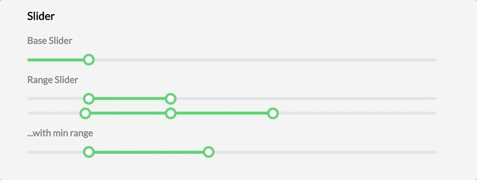

# React Tipso

[](https://badge.fury.io/js/rc-range-slider)  [](http://standardjs.com) [](https://www.npmjs.com/package/rc-range-slider) [](https://raw.githubusercontent.com/ecmadao/rc-range-slider/master/LICENSE)

[](https://nodei.co/npm/rc-range-slider)

A tooltip component for react.

## Screenshot



## Live demo

Click here: [https://ecmadao.github.io/rc-range-slider](https://ecmadao.github.io/rc-range-slider)

## Install

```bash
$ npm i rc-range-slider --save
```

### Build config

use webpack as example

```javascript
// webpack config file

// css loaders
const cssLoaders = [
  'style-loader',
  'css-loader?modules&importLoaders=1&localIdentName=[name]__[local]___[hash:base64:5]',
  'postcss-loader'
];

const webpackConfig = {
  module: {
    loaders: [
      {
        test: /\.css$/,
        include: /rc-range-slider|rc-tipso/,
        loaders: cssLoaders
      }
    ]
  },
  postcss: () => {
    return [
      require('postcss-cssnext')
    ]
  }
};
```

## Usage

```javascript
import Slider from 'rc-range-slider';

// ...

render() {
  return (
    <Slider value={[15, 35]} minRange={5}/>
  )
}
```

## Example

Click [here](./examples/SliderWrapper.jsx) to see tipso usage examples.

## Api

| name         | type            | default    | description                              |
| ------------ | --------------- | ---------- | ---------------------------------------- |
| className    | string          | `''`       | Custom className to change UI.           |
| tipFormatter | func            | `null`     | A function to custom tooltip value. Should return a string or DOM. |
| min          | number          | `0`        | Slider min value.                        |
| max          | number          | `100`      | Slider max value.                        |
| value        | number or array | `10`       | When it be a number, Slider will render single range select. Or pass a array to support multi range select. |
| minRange     | number          | `1`        | The minimum range value.                 |
| color        | string          | `green`    | Theme color. Support `green`, `dark`, `blue`, `red`, `gray` |
| onChange     | func            | `() => {}` | The callback when value changed.         |

## Dev

```bash
$ git clone git@github.com:ecmadao/rc-range-slider.git
$ cd rc-range-slider
$ npm i
$ npm run storybook
```

## License

Released under MIT License
